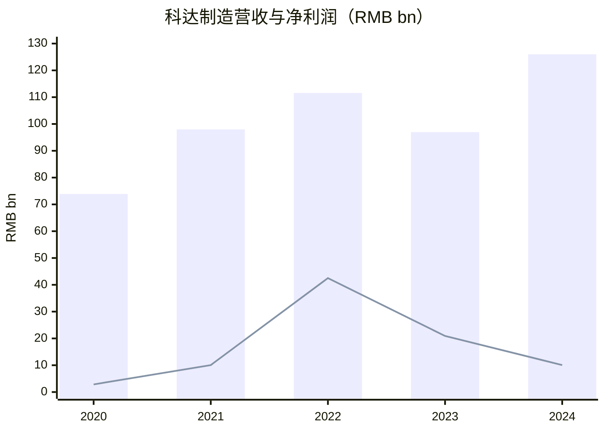

# 科达制造（SH:600499）买方分析

数据日期：财报与公告截至 2025-04-29；可检索行情截至 2026-03-12

## 1) 生意模式与护城河（含数据）
- 核心业务为 `建材机械 + 海外建材 + 锂电材料/战略投资`。
- 2024 年收入结构：
- 建材机械收入 `56.05 亿元`，占比约 `44.5%`，毛利率 `26.56%`。
- 海外建材收入 `47.15 亿元`，占比约 `37.4%`，毛利率 `31.20%`。
- 公司 2024 年总营收 `126.00 亿元`，归母净利 `10.06 亿元`。
- 护城河：
- 陶机整线能力强，公司长期披露自身为亚洲少数具备整厂整线输出能力的企业。
- 全球化服务网络覆盖 `80+` 国家和地区，海外客户售后、配件、耗材与改造形成粘性。
- 海外建材采用“渠道+本地制造”模式，截至 2024 年末在非洲六国拥有 `10` 个工厂、`19` 条瓷砖线、`2` 条洁具线、`2` 条玻璃线，复制能力已被验证。
- 结构性优势在于陶机全球竞争力和海外建材本地化制造；周期性变量主要是地产链、汇率与蓝科锂业投资收益波动。

## 2) 主要竞争对手分析
- 陶机竞争对手：SACMI、System Ceramics、SITI B&T 等欧洲厂商，以及国内区域设备厂。
- 海外建材的替代者主要是进口瓷砖和当地新建产能；A 股严格可比不多，可参考 `蒙娜丽莎`、`东鹏控股` 等建材制造商。
- 锂电材料相关可参考 `尚太科技`、`璞泰来`。
- 相对优势：
- 陶机与海外建材双主业协同稀缺，设备制造能力可直接反哺海外扩产。
- 海外建材毛利率显著高于机械业务，说明本地制造替代进口仍有利润护城河。
- 相对弱点：
- 利润表受锂价、蓝科锂业投资收益和汇兑影响较大。
- 业务组合较杂，估值锚不纯，市场容易在“设备股 / 出海建材股 / 锂链影子股”之间切换。

## 3) 股东回报（近5年）
- 政策：持续现金分红，2022 年后叠加较大规模回购，回购用途主要为员工持股计划/股权激励。

| FY | Dividend (RMB bn) | Buyback (RMB bn) | Dividend yield | Buyback yield | Total shareholder yield | Dividend/FCF | Buyback/FCF |
|---|---:|---:|---:|---:|---:|---:|---:|
| 2020 | 0.19 | Not disclosed | Not disclosed | Not disclosed | Not disclosed | Not disclosed | Not disclosed |
| 2021 | 0.34 | Not disclosed | Not disclosed | Not disclosed | Not disclosed | Not disclosed | Not disclosed |
| 2022 | 1.30 | 0.50 | Not disclosed | Not disclosed | Not disclosed | Not disclosed | Not disclosed |
| 2023 | 0.62 | Not disclosed | Not disclosed | Not disclosed | Not disclosed | Not disclosed | Not disclosed |
| 2024 | 0.37 | Not fully verified | Not disclosed | Not disclosed | Not disclosed | Not disclosed | Not disclosed |

```mermaid
xychart-beta
  title "科达制造分红与回购（RMB bn）"
  x-axis [2020, 2021, 2022, 2023, 2024]
  y-axis "RMB bn" 0 --> 1.4
  bar [0.19, 0.34, 1.30, 0.62, 0.37]
  bar [0, 0, 0.50, 0, 0]
```

- 已核实股东回报动作：
- `2022FY`：回购约 `30,563,538` 股，金额约 `5.0 亿元`。
- `2024FY`：2024-10-29 启动新一轮回购；截至 2025-03-31，回购专户持有 `59,999,862` 股，但 2024 财年内已执行金额本次未完整核实。

## 4) 近5年关键财务数据（含增长）

| 指标 | 2020 | 2024 | 增长 | CAGR |
|---|---:|---:|---:|---:|
| Revenue (RMB bn) | 73.90 | 126.00 | +70.5% | 14.3% |
| Net income (RMB bn) | 2.84 | 10.06 | +254.2% | 37.2% |
| EPS (RMB) | 0.166 | 0.534 | +221.7% | 33.9% |
| Operating cash flow (RMB bn) | 11.84 | 5.57 | -52.9% | -17.1% |
| ROE | 5.25% | 8.80% | +3.55ppt | N/A |

- 2022 年利润异常高，主要受蓝科锂业在锂价高位带来的投资收益驱动。
- 2023-2024 年利润回落，更多是锂价和汇兑因素，不完全代表主业恶化。
- `Gross margin / FCF / ROIC / Net debt`：本次检索未在一手文件中完整抓齐，未做伪精确填充。

## 5) 估值与历史分位
- 适用指标：`P/E + P/B`。公司利润受锂价和投资收益波动影响较大，因此单看 P/E 不够，P/B 需辅助。
- 截至 `2026-03-12` 的可检索行情：股价约 `17.86 元`，静态 `PE 23.58x`，`PB 2.18x`，总市值约 `342.7 亿元`。
- 理杏仁在 `2026-02-06` 记录的扣非 PE-TTM 为 `22.51x`，已处于 `5Y 99.45%` 分位；按 2026-03-12 更高的 PE 推断，仍处于近 5 年极高分位。
- PB 分位未检索到同日一手值；按理杏仁历史分布粗略看，当前 `2.18x` 处于中高分位，但不是极端高位。

## 6) 未来1-3年增长预测（基础情景）
- Revenue CAGR：中个位数到低双位数。
- EPS：若锂价不明显反弹，EPS 更可能温和修复，而不是回到 2022 年的异常高位。
- 关键驱动：
- 海外建材新产线投产和新品类放量。
- 陶机海外订单和海外收入占比。
- 蓝科锂业量价与投资收益。
- 汇兑损益和海外经营环境。

## 7) 持有该股票的机构（排除被动）

| 机构 | Holds this stock | 最近操作 | 披露日期 |
|---|---|---|---|
| 广东联塑科技实业有限公司 | Yes | 持有，未见退出 | 2025-10-31 |
| 广东宏宇集团有限公司 | Yes | 持有，未见退出 | 2025-10-31 |
| 佛山市新明珠企业集团有限公司 | Yes | 持有，未见退出 | 2025-10-31 |
| 安信灵活配置混合A | Yes | 仍在机构持仓名单 | 2025-10-31 |
| 安信远见成长混合A | Yes | 仍在机构持仓名单 | 2025-10-31 |
| 华泰柏瑞积极优选股票A | Yes | 出现在机构持仓名单 | 2025-10-31 |

## 8) 四位大佬视角

| Lens | Holds / Position % | Latest action + source date | Style anchors | Fit | Mismatch | Key watch items | Likely action triggers | Lens verdict |
|---|---|---|---|---|---|---|---|---|
| Chris Hohn | No | No public holding found | 现金流、资本效率、治理改善 | 海外建材有资产价值重估逻辑 | 业务较杂，利润波动大，激进治理空间有限 | 回购执行、海外建材 ROIC、资产剥离可能性 | 若业务更聚焦且估值错杀，才可能进入 | Weak fit |
| Bill Ackman | No | No public holding found | 集中持仓、可讲清楚的长期复利、催化剂 | 出海制造逻辑清晰 | A 股中盘、业务不纯、利润不稳 | 海外增长、资本配置、蓝科锂业扰动占比 | 若变成更纯粹的平台型建材出海资产，匹配度上升 | Weak fit |
| Conor Leonard | No / Not publicly disclosed | Not disclosed | 高 ROIC、再投资跑道、资本配置纪律 | 海外建材仍有扩产跑道 | 合并报表回报率被锂价与投资收益扭曲 | 新项目回报、主业 ROIC、扩产 payback | 主业回报率若能持续验证，会提升吸引力 | Partial fit |
| Terry Smith | No | No public holding found | 高质量、轻资产、高现金流、少折腾 | 海外建材有消费建材属性 | 重资产制造+周期投资收益并不符合其偏好 | 毛利率稳定性、现金流、业务纯度 | 若锂链影响淡化且现金回报更稳定，匹配度会改善 | Weak fit |

## 9) 做空方视角（Bear Case）
- 可做空理由：
- 当前 PE 已在近 5 年极高分位，但盈利质量受锂价与汇兑扰动较大。
- 海外建材增长需要持续资本开支和跨国执行，政治、税务、汇率风险并不低。
- 若蓝科锂业继续低迷，市场对公司“第二增长曲线”的估值耐心可能下降。
- 证伪条件：
- 海外建材连续几个季度维持高增长和稳定毛利率。
- 蓝科锂业利润企稳。
- 资本配置更清晰，市场重新按“出海建材龙头”而非“锂价波动受害者”定价。

## Final View
- Buy-side summary：科达制造最有价值的是 `陶机全球化能力 + 非洲本地建材复制能力`。这是结构性资产，不只是周期反弹。
- Bear-case summary：当前估值并不便宜，而利润确定性仍不足；若锂价和汇率继续扰动，估值扩张空间有限。
- Data confidence：Medium

## Sources
- 2024 年报摘要：https://static.cninfo.com.cn/finalpage/2025-03-27/1222912251.PDF
- 2025 年一季报：https://static.cninfo.com.cn/finalpage/2025-04-29/1223363931.PDF
- 2024 年年报摘要/全文摘录：https://money.finance.sina.com.cn/corp/view/vCB_AllBulletinDetail.php?id=10810883&stockid=600499
- 2023 年年报摘要摘录：https://money.finance.sina.com.cn/corp/view/vCB_AllBulletinDetail.php?id=9898174&stockid=600499
- 2022 年年报摘要摘录：https://money.finance.sina.com.cn/corp/view/vCB_AllBulletinDetail.php?id=8992639&stockid=600499
- 2021 年年报摘要摘录：https://money.finance.sina.com.cn/corp/view/vCB_AllBulletinDetail.php?id=7943180&stockid=600499
- 2020 年年报摘要摘录：https://money.finance.sina.com.cn/corp/view/vCB_AllBulletinDetail.php?id=7150152&stockid=600499
- 2022 回购公告：https://static.cninfo.com.cn/finalpage/2022-10-17/1214804702.PDF
- 行情与估值补充：
- https://quote.cfi.cn/quote1227_600499.html
- https://www.lixinger.com/equity/company/detail/sh/600499/600499
