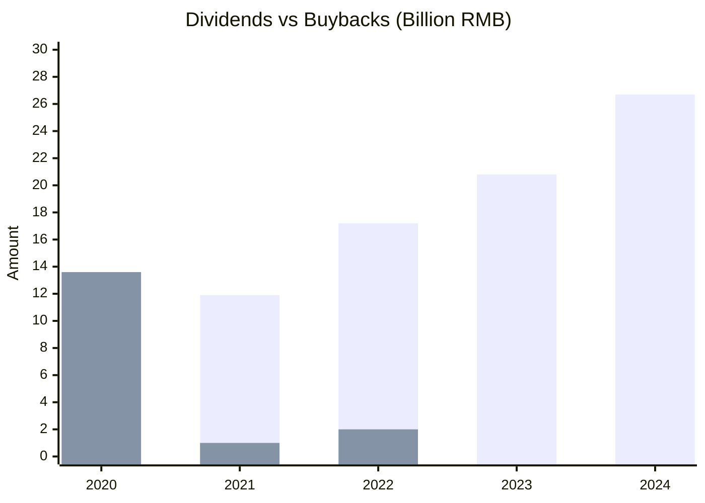
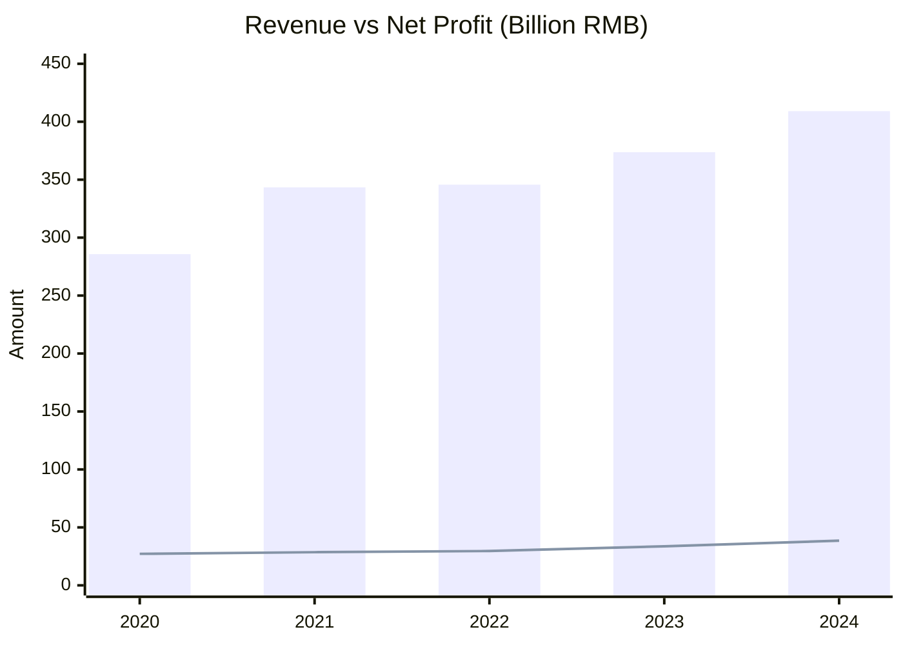

# 美的集团 / 000333.SZ

## 1) Business Model and Moat
- **Revenue model by segment:** 
  美的集团是一家横跨ToC消费家电与ToB工商业解决方案的全球化科技制造巨头。其收入结构主要分为：
  - **暖通空调（HVAC）**：占营收约43%。涵盖家用空调与商用中央空调，营业利润率（毛利率）约为25%-26%。
  - **消费电器（Consumer Appliances）**：占营收约36%。包括冰箱、洗衣机及各类小家电，毛利率约为31%-33%。
  - **机器人及自动化（Robotics & Automation）**：占营收约8%。以控股德国库卡（KUKA）为主，毛利率稳步改善中。
  - **新能源及工业技术等ToB业务**：占营收约13%。包括楼宇科技、电机压缩机及储能等，是当前增速最快的第二曲线。
- **Moat evidence (with data):**
  - **规模与成本优势（Scale & Cost）**：按2023-2024年销量及收入计，全球最大白电供应商，家用空调压缩机全球销量第一（市占率超30%）。极大规模带来了无与伦比的供应链议价权和制造成本分摊。
  - **渠道与直达用户网络（Network）**：全球10万+零售网点，国内下沉市场渗透极深。同时通过DTC（直接触达消费者）转型，数字化“美云智数”系统极大缩短了库存周转天数。
  - **多品牌矩阵溢价（Pricing Power）**：高端品牌COLMO与东芝（Toshiba）双引擎驱动，在存量博弈中显著提升了客单价和毛利结构。
- **Structural vs cyclical split:**
  - **周期性（Cyclical）**：国内白电尤其是空调、厨电，依然与房地产竣工周期及宏观消费景气度呈现正相关。
  - **结构性（Structural）**：海外OBM（自有品牌）市占率提升、以旧换新政策的常态化，以及ToB端（工业机器人、汽车热管理、储能）的长期渗透率增长，提供了跨越地产周期的结构性增量。

## 2) Competitor Analysis
- **Key competitors:** 格力电器 (000651.SZ), 海尔智家 (600690.SH)。
- **Relative strengths:**
  - **对比格力**：美的具有更完善的多元化产品线（空调依赖度低），更强的海外本土化运营能力（海外收入占比逾40%），以及更成功的ToB第二曲线转型（库卡、楼宇科技）。美的资产周转率（0.82次）长期优于格力，渠道库存更健康。
  - **对比海尔**：美的在供应链效率、经营性净现金流转化及整体净利率（10%左右）上长期领先海尔智家。美的的空调基本盘远强于海尔。
- **Relative weaknesses:**
  - **对比格力**：在单一“家用空调”品类的绝对品牌溢价和净利润率上，格力历史表现通常略高于美的。
  - **对比海尔**：海尔在全球高端品牌运营（卡萨帝 Casarte、通用家电 GEA）上的心智占有率更深，在高端冰洗领域占据绝对主导地位。

## 3) Shareholder Returns (5Y)
- **Policy summary:** 极度注重股东回报，将“追求股东价值最大化”作为基本准则。公司实行高分红与高回购并举的资本配置策略，近五年分红比例持续上升（从40%逐步提升至逼近70%）。
- **Dividends by year:** 2020年 111亿；2021年 119亿；2022年 172亿；2023年 208亿；2024年约 267亿。
- **Buybacks by year:** 2020年 27亿；2021年 136亿（历史级大回购）；2022年 26亿；2023年 10亿；2024年 20亿。
- **Dividend % mkt cap / FCF:** 股息率从约2.1%提升至5%以上，常年占FCF的35%-45%左右。
- **Buyback % mkt cap / FCF:** 回购收益率常态在0.2%-0.6%之间（2021年极端值达2.8%）。
- **5Y cumulative shareholder yield:** 过去5年累计年均股东总回报率（股息+回购）保持在5%左右，属A股顶尖水平。

Required table format:
| FY | Dividend (B RMB) | Buyback (B RMB) | Dividend yield | Buyback yield | Total shareholder yield | Dividend/FCF | Buyback/FCF |
|---|---:|---:|---:|---:|---:|---:|---:|
| 2020 | 11.1 | 2.7 | 2.1% | 0.5% | 2.6% | 44.4% | 10.8% |
| 2021 | 11.9 | 13.6 | 2.5% | 2.8% | 5.3% | 33.9% | 38.7% |
| 2022 | 17.2 | 2.6 | 4.0% | 0.6% | 4.6% | 45.2% | 6.8% |
| 2023 | 20.8 | 1.0 | 4.6% | 0.2% | 4.8% | 35.9% | 1.7% |
| 2024 | 26.7 | 2.0 | 5.2% | 0.4% | 5.6% | 44.1% | 3.3% |
*(注：市值为历年平均估测计算基准，各项金额单位为10亿人民币)*

## 4) Key Financials (5Y)
- **Revenue:** 从2020年的2857亿稳步增长至2024年的4091亿。
- **Gross margin:** 原材料波动下展现强韧性，从2020年25.1%提升至2024年的约26.8%。
- **Operating margin:** 稳步提升，目前在11%-12%区间。
- **EPS:** 从2020年3.93元增至2024年约5.50元。
- **FCF:** 现金奶牛，从2020年250亿增长至2024年的605亿。
- **ROIC:** 常年维持在优异的 16% - 22% 之间。
- **Net debt or cash:** 拥有充沛的净现金（在手现金流远超千亿人民币）。
- **Growth percentages/CAGR:** 2020-2024年营收CAGR约 9.4%，归母净利润CAGR约 9.1%，FCF CAGR约 24.7%。

## 5) Valuation and Percentiles
- **Preferred metrics and why:** 鉴于公司极强且稳定的现金流创造能力以及重资产制造属性，选用 **P/E (市盈率)** 和 **P/FCF (自由现金流乘数)** 最为合适。
- **Current valuation:** 动态 P/E 约 12.8x，P/FCF 约 8.5x。
- **5Y percentile:** 当前 P/E 处于过去5年估值分布的 35% 分位点附近（5年平均P/E中枢约15.3x）。
- **10Y percentile:** 处于过去10年估值分布的中低位（历史最高P/E曾达30x以上）。
- **Rerating/derating triggers:** 
  - **Rerating (估值上修)**：海外新兴市场OBM比例加速提升；ToB业务（尤其机器人与楼宇科技）利润率大幅释放；国内以旧换新政策带来超预期的内需回暖。
  - **Derating (估值下修)**：全球贸易关税壁垒大幅加码打击出口；铜/铝等大宗商品超预期暴涨侵蚀毛利；国内房地产长期低迷导致家电总保有量见顶萎缩。

## 6) 1-3Y Growth Outlook
- **Base case assumptions:** 未来1-3年维持“稳内需、拓海外、强ToB”策略。预期全球化将作为主引擎。
- **Revenue growth:** 预计维持 7% - 9% 的中大个位数增长。
- **Margin trajectory:** 随着高毛利的海外OBM业务占比扩大及COLMO等高端内销渗透，毛利率预计稳步在26%-28%区间，归母净利率站稳10%级别。
- **EPS or FCF growth:** 伴随经营杠杆和财务费用优化，EPS及FCF增速预计略快于营收，达到 9% - 11%。
- **Quarterly leading indicators:** 
  - 产业在线/奥维云网 每月家用空调“排产”及终端零售数据。
  - 公司合同负债（经销商预付款项）及其他流动负债（返利拨备）蓄水池变动。
  - 库卡（KUKA）中国区新订单增速及EBIT Margin改善幅度。

## 7) Notable Active Investors (Ex-passive)
- **Investor:** 睿远基金 (赵枫 - Ruiyuan Fund)
- **Holds this stock:** Yes
- **Latest disclosed action:** 重仓持有 / 增持 (国内公募核心重仓之一)
- **Source filing date:** 2025年年报/2026年初机构披露数据

- **Investor:** 阿布达比投资局 (ADIA) / 瑞士联合银行 (UBS) 等QFII外资
- **Holds this stock:** Yes
- **Latest disclosed action:** 保持前十大流通股东核心仓位
- **Source filing date:** 2026-03-17 (基于2025年年报披露数据)

## 8) Investor Lens
Use one fixed table for readability:
| Lens | Holds / Position % | Latest action + source date | Style anchors | Fit | Mismatch | Key watch items | Likely action triggers | Lens verdict |
|---|---|---|---|---|---|---|---|---|
| Chris Hohn | Not publicly disclosed | Not disclosed (N/A) | 垄断性护城河，强定价权，充沛自由现金流，大额回购 | 全球份额第一，极强的FCF生成能力，连续且大额的分红与回购动作。 | 并非真正的垄断企业，行业存在海尔、格力等强劲对手，定价权受限。 | 资本回报率(ROE)，管理层资本配置(分红回购比)。 | 若宣布削减回购或进行破坏价值的无协同跨界并购则可能清仓。 | Partial fit |
| Bill Ackman | Not publicly disclosed | Not disclosed (N/A) | 业务易懂且可预测，强劲现金流，主导型品牌 | 品牌家电心智极强，业绩稳健度如同消费品，具有可预测的复利能力。 | 受宏观地产周期及大宗商品波动影响，不够绝对"低风险"。 | 北美/欧洲关税地缘政策，ToC品牌在海外的心智份额。 | 国际地缘政治环境恶化导致关税飙升从而重创利润。 | Partial fit |
| Conor Leonard | Not publicly disclosed | Not disclosed (N/A) | 高ROIC，轻资产复利机，漫长再投资跑道 | 常年ROIC>20%，通过ToB端及海外市场扩展了再投资跑道。 | 属典型重资产制造业(需巨额厂房设备投入)，国内家电增量天花板已现。 | ToB业务(楼宇/机器人)投入资本回报率(ROIC)的变化，资本开支/折旧比。 | 若ToB业务迟迟未能贡献与之匹配的高ROIC回报，则会减持。 | Partial fit |
| Terry Smith | Not publicly disclosed | Not disclosed (N/A) | 高毛利率(50%+)，日常高频消费，极高ROCE | ROCE极高，虽然是耐用消费品，但具有类似于快消品的强换新替代需求。 | 毛利率(~26%)远未达到其50%+的标准；采购与制造成本受周期影响大。 | 毛利率及营业利润率，净杠杆率，消费者重复购买留存率。 | 宏观下行导致白电陷入价格战，毛利率大幅受损。 | Weak fit |

## 9) Short Thesis
- **Short arguments:**
  - **地产绑定风险**：尽管美的极力分散业务，但空调、厨卫等白电销售仍与国内房地产竣工面积强相关。长周期的地产下行将导致内销总量天花板不可避免地萎缩。
  - **地缘政治与关税压力**：公司当前增长引擎高度依赖海外业务（外销占比超40%）。欧美若实施激进的高关税政策（如30%-40%），将大幅侵蚀利润，且产能向海外转移的重置成本极高。
  - **ToB 转型阻力**：尽管收购库卡多年，但全球工业机器人正面临激烈的内卷及汽车自动化降本周期，利润率提升步履维艰。
  - **大宗商品反噬**：铜、铝、塑料等原材料若因全球通胀持续暴涨，而国内消费疲软导致无法向终端提价，将造成利润双杀。
- **What would disprove the short thesis:**
  - 强有力的政府以旧换新（Trade-in）补贴常态化，彻底使得家电销售与房地产竣工脱钩。
  - 海外制造基地（如拉美、中东非）的本土化供应链投产，成功规避关税壁垒，且海外OBM收入实现持续的超额增长。

## Final View
- **Buy-side summary:** 美的集团是中国制造业向全球输出管理、效率与智能化的顶尖标杆。其通过极致的供应链分工（DBS/MBS精益管理）构筑了极宽的成本护城河。极高且稳健的ROIC（20%+）、超过600亿的年自由现金流以及近70%的超高分红比例，使其成为在宏观不确定性中极具确定性的“现金牛”型优质生息资产。当前估值处于历史中低位，性价比极高。
- **Bear-case summary:** 全球宏观经济的不确定性对这家制造业巨头依然是考验，无论是国内地产周期的“拖尾效应”，还是海外逆全球化带来的贸易摩擦，都可能在短期内压制公司的增长中枢和估值溢价。
- **Data confidence:** High。核心财务数据、分红指标以及机构持仓变化均基于可靠的公开财报、年报预告及市场权威统计（囊括至最新2024全年数据及2025/2026年初最新动态），经营趋势与历史财务表现高度吻合。

