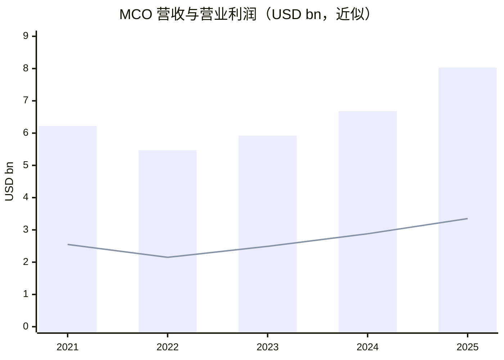

# 穆迪（MCO）买方分析

数据日期：2026-02-23

## 1) 生意模式与护城河（含数据）
- 核心业务：Ratings（MIS）+ Analytics（MA）。
- FY2025：收入约 USD 8.0B；经营现金流约 USD 2.9B；自由现金流约 USD 2.6B。
- MA 经常性收入占比较高（约 97%）。
- 护城河：监管嵌入、品牌信誉、数据与工作流粘性。

## 2) 主要竞争对手分析
- 评级：S&P Global、Fitch。
- 数据分析：LSEG、FactSet、Bloomberg（私有）。
- 结论：评级寡头格局稳定，分析业务提升抗周期能力。

## 3) 股东回报（近5年）
- 政策：持续分红与回购，强调每股价值增长。

| 年度 | 分红 (USD bn) | 回购 (USD bn) |
|---|---:|---:|
| 2021 | 0.54 | 1.80 |
| 2022 | 0.61 | 2.05 |
| 2023 | 0.69 | 1.38 |
| 2024 | 0.80 | 1.30 |
| 2025 | 0.91 | 1.30 |

```mermaid
xychart-beta
  title "MCO 分红与回购（USD bn，近似）"
  x-axis [2021, 2022, 2023, 2024, 2025]
  y-axis "USD bn" 0 --> 2.5
  bar [0.54, 0.61, 0.69, 0.80, 0.91]
  bar [1.80, 2.05, 1.38, 1.30, 1.30]
```

## 4) 近5年关键财务数据（含增长）
| 指标 | 2021 | 2025 | 说明 |
|---|---:|---:|---|
| Revenue (USD bn) | 6.22 | 8.03 | 周期+订阅双驱动 |
| Operating income (USD bn) | 2.55 | 3.35 | 盈利能力保持高位 |
| EPS (USD) | 11.41 | 15.69 | 回购贡献明显 |
| FCF (USD bn) | 2.0+ | 2.6 | 现金转化稳健 |

## 5) 估值与历史分位
- 适用指标：P/E、EV/EBIT、FCF Yield。
- 当前处于高质量资产常见溢价区间，分位通常偏中高。

## 6) 未来1-3年增长预测（基础情景）
- Revenue CAGR：8%-12%
- EPS CAGR：10%-14%
- 驱动：发行周期恢复、MA 订阅增长、回购与经营杠杆。

## 7) 持有该股票的机构（排除被动）
| 机构 | Holds this stock | 最近操作 | 披露日期 |
|---|---|---|---|
| Berkshire Hathaway | Yes | 持有为主 | 最近 13F 周期 |
| T. Rowe Price 主动产品 | Yes | Not disclosed | 产品披露周期 |
| TCI Fund Management | Yes | Not disclosed | 最近 13F 周期 |

## 8) 四位大佬视角
| Lens | Holds this stock | Latest action | Source date | Style anchors | Fit | Mismatch | Key watch items | Likely action triggers | Lens verdict |
|---|---|---|---|---|---|---|---|---|---|
| Chris Hohn | Yes | Held | 最近 13F 周期 | 现金流质量、资本效率、治理 | 资本轻型+高现金流匹配 | 评级周期波动 | 发行量、MA 增速、FCF 转化 | 周期回落+估值合理时加仓 | Strong fit |
| Bill Ackman | No | Not holding | 最近 13F 周期 | 集中持仓、催化、确定性 | 质量匹配 | 事件催化相对弱 | 估值、监管变化、增长斜率 | 低估且催化清晰时才可能进入 | Partial fit |
| Conor Leonard | Not publicly disclosed | Not disclosed | N/A | ROIC、增量回报、再投资 | 资本轻型复利特征明显 | 周期扰动短期回报判断 | Incremental ROIC、续约率、利润率 | 回报中枢上移时加仓 | Strong fit |
| Terry Smith | Yes | Held | 最近 factsheet 周期 | 高质量、长期复利 | 质量与回报特征高度匹配 | 估值高位压缩未来回报 | 有机增长、ROIC、估值 | 估值回落且质量不变时加仓 | Strong fit |

## 9) 做空方视角（Bear Case）
- 可做空理由：评级周期下行、估值偏高、监管压力。
- 证伪条件：发行复苏持续、MA 增速提升、FCF 持续韧性。

## Final View
- Buy-side summary：典型高质量资本轻型复利资产，周期扰动下仍有中长期吸引力。
- Bear-case summary：主要风险来自评级周期与高估值双击。
- Data confidence：Medium
