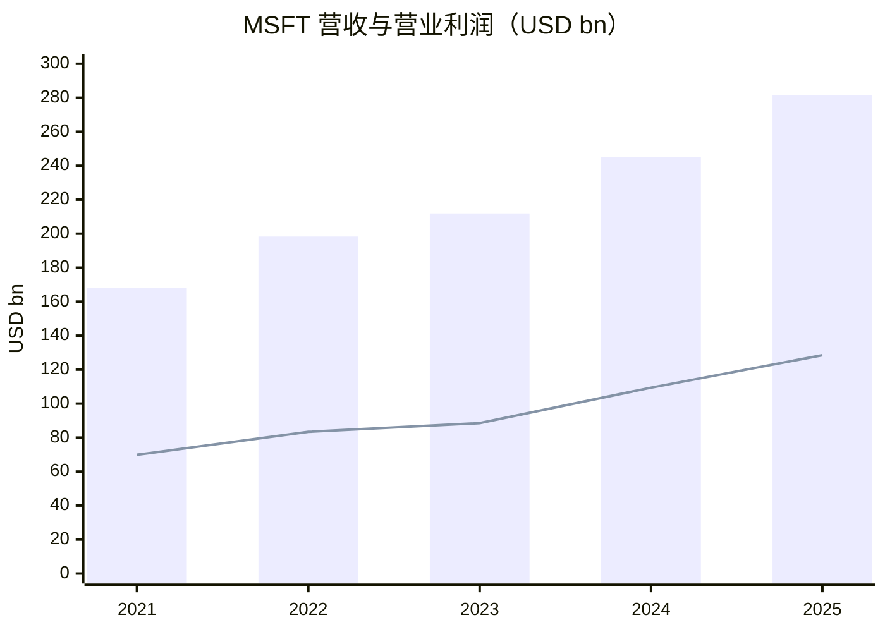

# 微软（MSFT）买方分析（GitHub 中文版）

分析日期：2026-02-23

## 投资结论（基础情景）
微软仍是高质量复利资产。当前核心变量是 AI 资本开支能否在未来 1-3 年持续转化为利润与自由现金流。

## 1) 生意模式与护城河（含数据）
- FY2025 营收：USD 281.724B；营业利润：USD 128.528B；净利润：USD 101.832B。  
- FY2025 分部营收：
- Productivity and Business Processes：USD 122.5B
- Intelligent Cloud：USD 106.3B
- More Personal Computing：USD 52.9B
- FY2025 毛利率约 68.8%，营业利润率约 45.6%。
- 护城河证据：
- 企业软件与云平台一体化生态（Office/Windows/Azure/Security/Data）。
- 大规模分发能力与企业客户切换成本。
- 高强度研发与基础设施投入能力。

## 2) 主要竞争对手分析
- AWS（Amazon）：2025 年收入 USD 128.7B，营业利润 USD 45.6B。
- Google Cloud（Alphabet）：2025 年收入 USD 58.7B，营业利润 USD 13.9B。
- 微软 Intelligent Cloud：FY2025 收入 USD 106.3B。
- 对比结论：微软在企业全栈整合和客户粘性上优势明显，但 AI 工作负载竞争与定价压力仍需跟踪。

## 3) 股东回报（近5个财年）
政策：稳定分红 + 回购，同时维持对 AI/云基础设施的持续投入。

| FY | 分红 (USD bn) | 回购 (USD bn) | 分红/FCF | 回购/FCF | 对应当年市值股东回报率 |
|---|---:|---:|---:|---:|---:|
| 2021 | 16.9 | 21.9 | 30.1% | 39.0% | 1.54% |
| 2022 | 18.6 | 27.0 | 28.5% | 41.4% | 2.55% |
| 2023 | 20.2 | 17.6 | 34.0% | 29.5% | 1.35% |
| 2024 | 22.3 | 11.5 | 30.1% | 15.6% | 1.06% |
| 2025 | 24.7 | 12.6 | 34.5% | 17.6% | 1.03% |

5年累计：分红 USD 102.6B；回购 USD 90.5B。

```mermaid
xychart-beta
  title "分红与回购（USD bn）"
  x-axis [2021, 2022, 2023, 2024, 2025]
  y-axis "USD bn" 0 --> 30
  bar [16.9, 18.6, 20.2, 22.3, 24.7]
  bar [21.9, 27.0, 17.6, 11.5, 12.6]
```

## 4) 近5年关键财务数据（含增长）
| 指标 | 2021 | 2025 | 期间增长 | CAGR (2021-2025) |
|---|---:|---:|---:|---:|
| 营收 (USD bn) | 168.1 | 281.7 | +67.6% | 13.8% |
| 营业利润 (USD bn) | 69.9 | 128.5 | +83.8% | 16.4% |
| 净利润 (USD bn) | 61.3 | 101.8 | +66.2% | 13.5% |
| 稀释 EPS (USD) | 8.05 | 13.64 | +69.4% | 14.1% |
| 自由现金流 FCF (USD bn) | 56.1 | 71.6 | +27.6% | 6.3% |

解读：利润增长快于 FCF，主要由高 Capex 阶段导致。

## 5) 估值与5年/10年分位
- 适用指标：P/E + EV/FCF。
- TTM P/E：约 24.8x（截至 2026-02-23）。
- Forward P/E：约 28.0x（截至 2026-02-23，一致预期口径）。
- 历史分位（P/E 序列近似）：
- 5年分位：约 0%
- 10年分位：约 20%

## 6) 未来1-3年增长预测（基础情景）
- 营收 CAGR：11% 至 14%
- 营业利润 CAGR：13% 至 16%
- EPS CAGR：12% 至 15%
- 关键变量：Azure 增速、Copilot 商业化、Capex 强度与 FCF 回收。

## 7) 持有该股票的机构（排除被动）
说明：本节只列“持有 MSFT 的机构”，不等同于第8节四位投资大佬。

| 机构 | Holds this stock | 最近操作 | 披露日期 | 说明 |
|---|---|---|---|---|
| TCI Fund Management | Yes | 增持（+23.63%） | 2025-05-15（Q1 2025 13F） | Fintel 摘要显示较上一季增持 |
| Bridgewater Associates | Yes | 增持（+21.35%） | 2025-05-14（Q1 2025 13F） | Fintel 摘要显示较上一季增持 |
| Fisher Asset Management | Yes | 未在摘要中给出明确增减比例 | 2026-02-09（Q4 2025 13F） | 13F 列示其为 MSFT 重要持仓之一 |

## 8) 四位投资大佬视角（含是否持有与最近操作）
### Chris Hohn 视角
- Holds this stock: Yes
- Latest action: 持有（最新 13F 前列持仓），公开摘要未给出 Q4 对 Q3 的精确增减比例
- Source filing or letter date: 2026-02-17（TCI Q4 2025 13F）
- 风格匹配：高质量、高现金流、高确定性资产；核心跟踪增量资本回报。

### Bill Ackman 视角
- Holds this stock: No
- Latest action: 最近 13F 组合未见 MSFT（可视为未持有）
- Source filing or letter date: 2025-11-14（Pershing Square Q3 2025 13F）
- 风格匹配：业务质量匹配，但其当前组合并未配置微软。

### Conor Leonard 视角
- Holds this stock: Not publicly disclosed
- Latest action: Not disclosed
- Source filing or letter date: N/A
- 风格匹配：更接近 Reinvestment Moat / Capital-Light Compounder 混合；核心看 AI 投入后的 Incremental ROIC。

### Terry Smith 视角
- Holds this stock: Yes（官方月度评论将 Microsoft 列为组合当月 detractor）
- Latest action: Not disclosed（未披露明确增减笔数或仓位变化）
- Source filing or letter date: 2026-01 月度评论（发布于 2026-02 factsheet 页面）
- 风格匹配：质量复利框架高度匹配，关注估值与回报持续性。

## 9) 做空方视角（Bear Case）
可做空理由：
- AI Capex 维持高位，若需求兑现慢于预期，FCF 与回报率承压。
- 云与 AI 竞争导致价格和利润率压力。
- 大盘核心资产一旦增速回落，估值可能压缩。

证伪条件：
- Azure 增速与利润率维持韧性。
- Copilot 商业化指标持续改善。
- 未来 4-8 个季度 Capex 强度边际回落并推动 FCF 再加速。

## 主要来源
- Microsoft FY2025 10-K：https://www.microsoft.com/investor/reports/ar25/index.html
- Microsoft FY2023 10-K：https://www.microsoft.com/investor/reports/ar23/index.html
- Amazon 2025 results（含 AWS）：https://www.aboutamazon.com/news/company-news/amazon-q4-2025-earnings-report
- Alphabet Investor Relations（含 10-K）：https://abc.xyz/investor/
- TCI 13F manager page：https://13f.info/manager/0001647251-tci-fund-management-ltd
- Pershing Square 13F manager page：https://13f.info/manager/0001336528-pershing-square-capital-management-l-p
- Fisher 13F manager page：https://13f.info/manager/0000850529-fisher-asset-management-llc
- TCI 对 MSFT 变动摘要：https://fintel.io/so/us/msft/tci-fund-management
- Bridgewater 对 MSFT 变动摘要：https://fintel.io/so/us/msft/bridgewater-associates-lp
- Fundsmith factsheet（含 2026-01 组合评论）：https://www.fundsmith.co.uk/factsheet/
- Connor 框架原文：https://sabercapitalmgt.com/wp-content/uploads/2018/04/IMC-2017-Annual-Letter.pdf

数据置信度：Medium
- 公司财务数据为高置信度（主要来自公司/监管披露）。
- 部分机构增减仓百分比来自二级汇总页面，已标注日期与来源。
