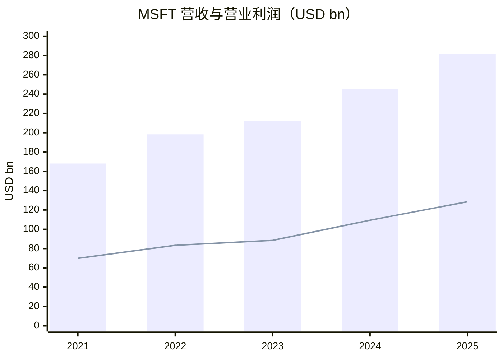

# 微软（MSFT）买方分析（GitHub 中文版）

分析日期：2026-02-23

## 投资结论（基础情景）
MSFT 仍是高质量复利型资产。当前核心争议不在“有没有护城河”，而在于 AI 资本开支能否在未来 1-3 年持续转化为增量利润和自由现金流。

## 1) 生意模式与护城河（含数据）
- FY2025 营收：USD 281.7B；营业利润：USD 128.5B；净利润：USD 101.8B。
- FY2025 分部结构：
  - 生产力与业务流程（Productivity and Business Processes）：USD 122.5B
  - 智能云（Intelligent Cloud）：USD 106.3B
  - 更多个人计算（More Personal Computing）：USD 52.9B
- FY2025 毛利率约 68.8%，营业利润率约 45.6%。
- 护城河证据：
  - 企业生态锁定（Office/Windows/Azure/安全/数据平台一体化）。
  - 全球分发与规模优势（尤其在 AI 基础设施投入能力）。
  - 大客户长期合同和较高切换成本。

## 2) 主要竞争对手分析
- AWS（亚马逊）：2025 年收入 USD 128.7B，营业利润 USD 45.6B。
- Google Cloud（Alphabet）：2025 年收入 USD 58.7B，营业利润 USD 13.9B。
- MSFT 智能云：FY2025 收入 USD 106.3B。
- 结论：
  - 微软在企业全栈和客户粘性方面优势明显。
  - 风险主要来自 AI 工作负载竞争与云定价压力。

## 3) 股东回报（近5个财年）
政策：稳定提高分红 + 回购，同时保留战略性资本开支能力。

| FY | 分红 (USD bn) | 回购 (USD bn) | 分红/FCF | 回购/FCF | 对应当年市值股东回报率 |
|---|---:|---:|---:|---:|---:|
| 2021 | 16.9 | 21.9 | 30.1% | 39.0% | 1.54% |
| 2022 | 18.6 | 27.0 | 28.5% | 41.4% | 2.55% |
| 2023 | 20.2 | 17.6 | 34.0% | 29.5% | 1.35% |
| 2024 | 22.3 | 11.5 | 30.1% | 15.6% | 1.06% |
| 2025 | 24.7 | 12.6 | 34.5% | 17.6% | 1.03% |

5年累计：
- 分红：USD 102.6B
- 回购：USD 90.5B

```mermaid
xychart-beta
  title "分红与回购（USD bn）"
  x-axis [2021, 2022, 2023, 2024, 2025]
  y-axis "USD bn" 0 --> 30
  bar [16.9, 18.6, 20.2, 22.3, 24.7]
  bar [21.9, 27.0, 17.6, 11.5, 12.6]
```

## 4) 近5年关键财务数据（含增长）
| 指标 | 2021 | 2025 | 期间增长 | CAGR (2021-2025) |
|---|---:|---:|---:|---:|
| 营收 (USD bn) | 168.1 | 281.7 | +67.6% | 13.8% |
| 营业利润 (USD bn) | 69.9 | 128.5 | +83.8% | 16.4% |
| 净利润 (USD bn) | 61.3 | 101.8 | +66.2% | 13.5% |
| 稀释 EPS (USD) | 8.05 | 13.64 | +69.4% | 14.1% |
| 自由现金流 FCF (USD bn) | 56.1 | 71.6 | +27.6% | 6.3% |

解读：利润增长显著快于 FCF，主要原因是 AI 相关资本开支上行。

## 5) 估值与5年/10年分位
适用估值指标：P/E + EV/FCF（更能反映 AI Capex 对现金流的影响）。
- TTM P/E：约 24.8x
- Forward P/E：约 28.0x（基于一致预期）
- 历史分位（P/E 序列近似）：
  - 5年分位：约 0%
  - 10年分位：约 20%

解读：当前不在历史高估值极端区间，后续回报更依赖盈利兑现。

## 6) 未来1-3年增长预测
基础情景：
- 营收 CAGR：11% 至 14%
- 营业利润 CAGR：13% 至 16%
- EPS CAGR：12% 至 15%

关键驱动：
- Azure 增长与 AI 商业化（Copilot、企业 AI 工作负载）。
- 规模效应与高 Capex 并行下的利润率演化。
- 企业 IT 周期与云价格竞争。

## 7) 著名投资者（排除被动）
| 投资者 | 是否持有 MSFT | 最近披露动作 | 日期 |
|---|---|---|---|
| Chris Hohn（TCI） | 是 | 最近一期 13F 仍持有 | 2025-11-14 |
| Bill Ackman（Pershing Square） | 否 | 最近一期 13F 未见 MSFT | 2025-11-14 |
| Conor Leonard（Saber/IMC） | 暂无公开可核持仓披露 | 未找到强制披露持仓文件 | N/A |
| Terry Smith（Fundsmith） | 是 | 月报/事实表提及微软为组合波动来源，隐含仍持有 | 2026-01 |

## 8) 著名投资者视角（含是否持有）
### Chris Hohn 视角（是否持有：是）
- 匹配点：高质量现金流、治理与资本配置可评估。
- 关注点：AI 投入后的增量回报与资本纪律。

### Bill Ackman 视角（是否持有：否）
- 匹配点：业务质量高、可预测性强。
- 不匹配点：当前披露组合重心不在微软，缺少其偏好的事件型催化。

### Conor Leonard 视角（是否持有：未公开）
- 框架匹配：更像 Reinvestment Moat / Capital-Light Compounder 混合。
- 核心检验：AI 投入周期下 Incremental ROIC 能否维持。

### Terry Smith 视角（是否持有：是）
- 匹配点：高回报、可持续复利、商业模式质量高。
- 风险点：估值与 AI 投入期的回报兑现节奏。

## 9) 做空方视角（Bear Case）
当前可做空理由：
- AI 资本开支强度高，若需求转化不及预期，FCF 与回报率可能低于市场预期。
- 云与 AI 竞争加剧可能带来价格和利润率压力。
- 大市值高质量资产若增长放缓，估值可能被动压缩。

做空证伪条件：
- Azure 增速与利润率保持韧性。
- Copilot 与 AI 产品渗透推动 ARPU 和留存持续改善。
- Capex 强度在未来 4-8 个季度逐步回落，FCF 重新加速。

## 信源说明
核心财务与业务数据（优先一手）：
- Microsoft FY2025 Form 10-K: https://www.microsoft.com/investor/reports/ar25/index.html
- Microsoft FY2023 Form 10-K: https://www.microsoft.com/investor/reports/ar23/index.html
- Amazon 2025 年报新闻稿（含 AWS）: https://www.aboutamazon.com/news/company-news/amazon-q4-2025-earnings-report
- Alphabet 投资者关系（含 10-K）: https://abc.xyz/investor/

投资者持仓状态参考：
- TCI 13F: https://13f.info/manager/0001647251-tci-fund-management-ltd
- Pershing Square 13F: https://13f.info/manager/0001336528-pershing-square-capital-management-l-p
- Fundsmith factsheet: https://www.fundsmith.co.uk/factsheet/
- Connor 框架原文: https://sabercapitalmgt.com/wp-content/uploads/2018/04/IMC-2017-Annual-Letter.pdf

数据置信度：Medium
- 公司核心财务数据置信度高。
- 个别投资者持仓因披露制度差异（尤其非美机构）置信度中等。
