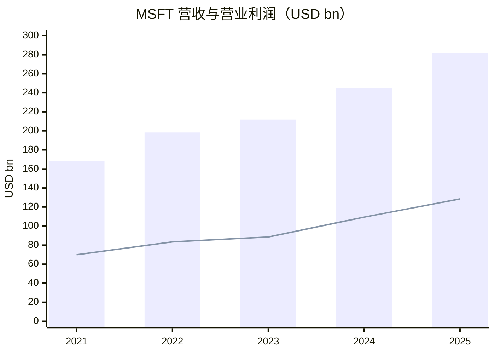

# 微软（MSFT）买方分析

数据日期：2026-02-23

## 1) 生意模式与护城河（含数据）
- FY2025：营收 USD 281.7B，营业利润 USD 128.5B，净利润 USD 101.8B。
- 分部营收：PBP USD 122.5B，Intelligent Cloud USD 106.3B，MPC USD 52.9B。
- FY2025 毛利率约 68.8%，营业利润率约 45.6%。
- 护城河：企业软件生态锁定、云平台规模优势、AI 基础设施投入能力、企业客户切换成本。

## 2) 主要竞争对手分析
- AWS：2025 收入 USD 128.7B，营业利润 USD 45.6B。
- Google Cloud：2025 收入 USD 58.7B，营业利润 USD 13.9B。
- 结论：MSFT 在企业全栈整合上优势明显，风险在 AI 工作负载竞争与云定价。

## 3) 股东回报（近5年）
- 政策：稳定分红 + 回购，同时保证增长性 Capex。

| FY | Dividend (USD bn) | Buyback (USD bn) | Dividend yield | Buyback yield | Total shareholder yield | Dividend/FCF | Buyback/FCF |
|---|---:|---:|---:|---:|---:|---:|---:|
| 2021 | 16.9 | 21.9 | 0.67% | 0.87% | 1.54% | 30.1% | 39.0% |
| 2022 | 18.6 | 27.0 | 1.04% | 1.51% | 2.55% | 28.5% | 41.4% |
| 2023 | 20.2 | 17.6 | 0.72% | 0.63% | 1.35% | 34.0% | 29.5% |
| 2024 | 22.3 | 11.5 | 0.70% | 0.36% | 1.06% | 30.1% | 15.6% |
| 2025 | 24.7 | 12.6 | 0.68% | 0.35% | 1.03% | 34.5% | 17.6% |

```mermaid
xychart-beta
  title "MSFT 分红与回购（USD bn）"
  x-axis [2021, 2022, 2023, 2024, 2025]
  y-axis "USD bn" 0 --> 30
  bar [16.9, 18.6, 20.2, 22.3, 24.7]
  bar [21.9, 27.0, 17.6, 11.5, 12.6]
```

## 4) 近5年关键财务数据（含增长）
| 指标 | 2021 | 2025 | 增长 | CAGR |
|---|---:|---:|---:|---:|
| Revenue (USD bn) | 168.1 | 281.7 | +67.6% | 13.8% |
| Operating income (USD bn) | 69.9 | 128.5 | +83.8% | 16.4% |
| Net income (USD bn) | 61.3 | 101.8 | +66.2% | 13.5% |
| EPS (USD) | 8.05 | 13.64 | +69.4% | 14.1% |
| FCF (USD bn) | 56.1 | 71.6 | +27.6% | 6.3% |

## 5) 估值与历史分位
- 适用指标：P/E + EV/FCF。
- TTM P/E：约 24.8x；Forward P/E：约 28.0x。
- 历史分位（P/E 序列近似）：5年约 0%，10年约 20%。

## 6) 未来1-3年增长预测（基础情景）
- Revenue CAGR：11%-14%
- Operating income CAGR：13%-16%
- EPS CAGR：12%-15%
- 核心变量：Azure 增速、Copilot 商业化、Capex 强度与 FCF 回收。

## 7) 持有该股票的机构（排除被动）
| 机构 | Holds this stock | 最近操作 | 披露日期 |
|---|---|---|---|
| TCI Fund Management | Yes | 增持（公开摘要） | 2025-05-15 |
| Bridgewater Associates | Yes | 增持（公开摘要） | 2025-05-14 |
| Fisher Asset Management | Yes | 持有（摘要未给明确增减） | 2026-02-09 |

## 8) 四位大佬视角
| Lens | Holds / Position % | Latest action + source date | Style anchors | Fit | Mismatch | Key watch items | Likely action triggers | Lens verdict |
|---|---|---|---|---|---|---|---|---|
| Chris Hohn | Yes (position % not disclosed in current source snapshot) | Held, 2026-02-17 (Q4 2025 13F cycle) | 现金流质量、资本效率、治理 | 高质量现金流与资本分配纪律匹配 | 超大盘事件催化较弱 | Azure 增速、AI ROIC、Capex/FCF | 回报持续高且估值回落时加仓 | Strong fit |
| Bill Ackman | No | Not holding, 2025-11-14 (Q3 2025 13F) | 集中持仓、催化、确定性 | 业务质量符合 | 当前组合未配置，催化属性偏弱 | 估值回落、监管事件、增长弹性 | 出现明显错杀与催化时可能进入 | Partial fit |
| Conor Leonard | Not publicly disclosed | Not disclosed, N/A | ROIC、增量ROIC、再投资跑道 | 长期再投资能力强 | AI 重投入期需验证增量回报 | Incremental ROIC、边际利润、FCF转化 | 增量回报连续验证时加仓 | Strong fit |
| Terry Smith | Yes (position % not disclosed in monthly factsheet) | Held, 2026-01 (Fundsmith monthly commentary) | 高质量、长期复利、高回报 | 护城河与盈利质量高度匹配 | 估值与回报兑现节奏风险 | 毛利率、ROIC、有机增长 | 估值回落且质量不变时加仓 | Strong fit |

## 9) 做空方视角（Bear Case）
- 可做空理由：AI Capex 高位若回报不及预期；云竞争压利润率；增速下修引发估值压缩。
- 证伪条件：Azure 和 Copilot 商业化超预期，Capex 强度回落并带动 FCF 再加速。

## Final View
- Buy-side summary：高质量复利资产，重点跟踪 AI 投入回报兑现。
- Bear-case summary：核心风险是高投入低回报导致的估值与现金流双压。
- Data confidence：Medium
