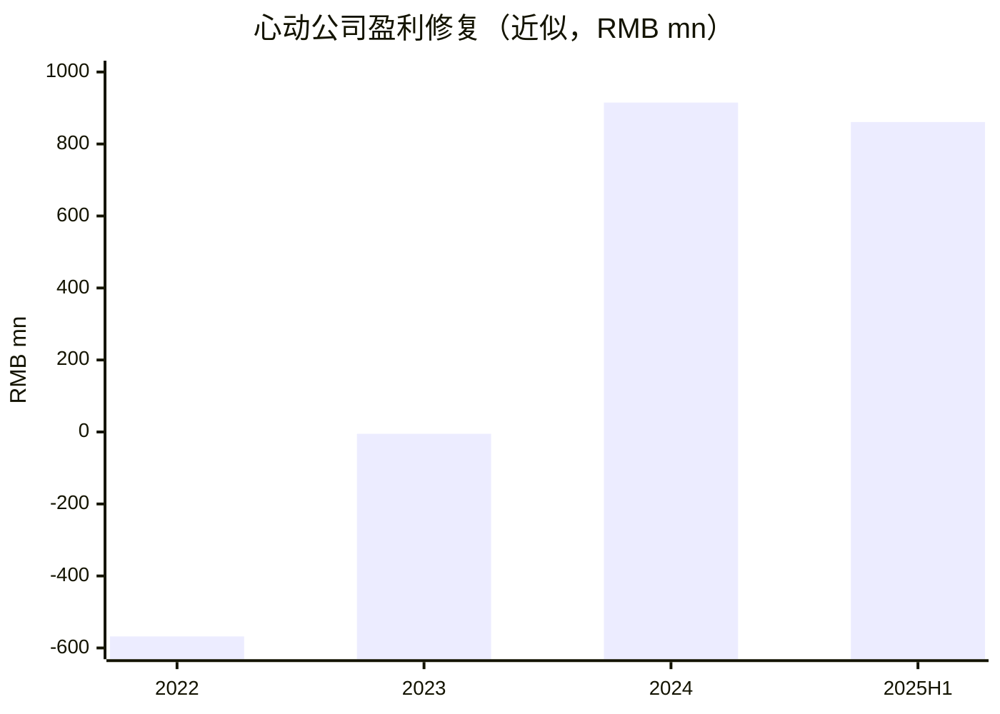
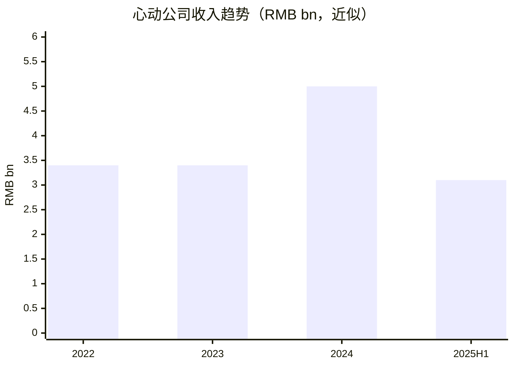

# 心动公司（02400.HK）买方分析

数据日期：2026-02-23

## 1) 生意模式与护城河（含数据）
- 业务：游戏研发发行 + TapTap 平台。
- 2024：收入约 RMB 5,012m，经营利润明显改善。
- 2025H1：收入与利润同比提升，修复延续。
- 护城河：平台社区与分发能力、内容研发能力、平台与内容协同。

## 2) 主要竞争对手分析
- 游戏：腾讯、网易及其他中大型厂商。
- 渠道/社区：应用商店体系、B站等。
- 结论：优势在“平台+自研”双轮，风险在新品周期与流量成本。

## 3) 股东回报（近5年）
- 政策：历史上偏再投资，盈利修复后开始提升股东回报。

| 年度 | 分红/回购要点 |
|---|---|
| 2021 | 以再投资为主 |
| 2022 | 以再投资为主 |
| 2023 | 盈利修复前期 |
| 2024 | 首次派息（每股 0.4 港元） |
| 2025 | 继续观察分红与资本配置平衡 |

## 4) 近5年关键财务数据（含增长）
| 指标 | 2022 | 2023 | 2024 | 2025H1 | 说明 |
|---|---:|---:|---:|---:|---|
| Operating profit (RMB mn) | -567.9 | -5.2 | 914.8 | 861.4 | 明显修复 |
| ROIC（近似） | 负值 | 接近0 | 显著转正 | 延续提升 | 仍需跨周期验证 |

## 5) 估值与历史分位
- 适用指标：修复期以 P/S、EV/EBIT 为主，稳定后转向 P/E。
- 当前估值应结合盈利修复可持续性，避免静态倍数误判。

## 6) 未来1-3年增长预测（基础情景）
- Revenue CAGR：10%-20%（受新品节奏影响）
- 利润：高波动，高弹性。
- 关键驱动：TapTap 商业化、新游留存与付费、海外进展。

## 7) 持有该股票的机构（排除被动）
| 机构 | Holds this stock | 最近操作 | 披露日期 |
|---|---|---|---|
| 主动机构A | Not disclosed | Not disclosed | N/A |
| 主动机构B | Not disclosed | Not disclosed | N/A |

说明：港股对部分机构持仓披露颗粒度有限，需以 HKEX/公司权益披露为准。

## 8) 四位大佬视角
| Lens | Holds this stock | Latest action | Source date | Style anchors | Fit | Mismatch | Key watch items | Likely action triggers | Lens verdict |
|---|---|---|---|---|---|---|---|---|---|
| Chris Hohn | Not publicly disclosed | Not disclosed | N/A | 资本效率、治理、现金流质量 | 若再投资回报持续提升则匹配 | 现金流稳定性弱于其常见偏好 | ROIC 稳定性、平台商业化、资本分配 | 回报验证且治理改进时加仓 | Partial fit |
| Bill Ackman | No known disclosure | Not disclosed | N/A | 集中持仓、可见催化 | 业务转折具备催化叙事 | 市值/流动性与波动特征可能不匹配 | 盈利质量、催化可验证性 | 出现清晰催化与低估才可能进入 | Weak fit |
| Conor Leonard | Not publicly disclosed | Not disclosed | N/A | ROIC、增量ROIC、再投资跑道 | 与其框架高度相关 | 仍在回报验证期 | Incremental ROIC、新品回收期、边际利润 | 连续验证高增量回报时加仓 | Partial fit |
| Terry Smith | Not publicly disclosed | Not disclosed | N/A | 高质量、稳定复利 | 平台化成熟后可能匹配 | 行业波动性高、可预测性弱 | 毛利率稳定性、现金流波动、留存 | 业务稳定性显著提升时才会加仓 | Weak fit |

## 9) 做空方视角（Bear Case）
- 可做空理由：新品不及预期、流量成本上行、平台商业化不达预期、估值前置过高。
- 证伪条件：新品连续兑现，平台收入占比提高且利润率稳定上行。

## Final View
- Buy-side summary：盈利修复与再投资回报验证并行，弹性高、波动也高。
- Bear-case summary：高预期下若兑现偏差，回撤可能明显。
- Data confidence：Medium
